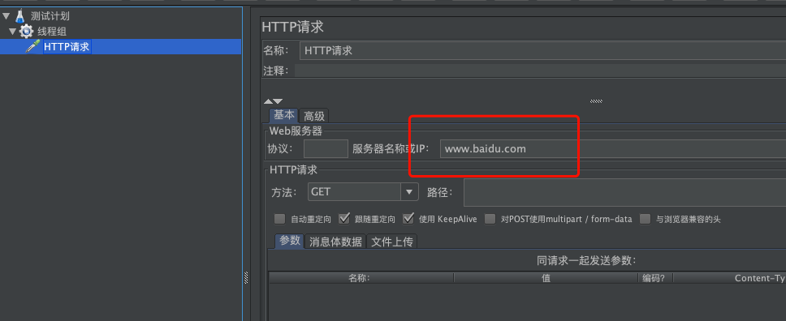

## JMETER 入门

1. 安装 && 运行

    ```
    brew cask install java
    brew install jmeter
    ```

    > **brew和brew cask的区别**:   
    > brew cask是已经编译好了的应用包(.dmg/.pkg)  
    > 仅仅是下载解压，放在统一的目录中(/opt/homebrew-cask/Caskroom),   
    > 省掉了自己去下载、解压、拖拽(安装)等蛋疼的步骤，同样，卸载相当容易与干净。 
    >  
    > @https://blog.csdn.net/yanxiaobo1991/article/details/78455908

    然后，打开运行

    ```
    /usr/local/bin/jmeter
    ```

2. 添加线程组（用户）

    

3. 添加请求

    http请求的属性值中“Web服务器名称或IP”填写www.baidu.com就可以了

    
    

4. 添加监视器（查看结果）

    

5. 运行

      


## 参考资料

- [Mac安装Jmeter](https://blog.csdn.net/zlfssq/article/details/80521215)

