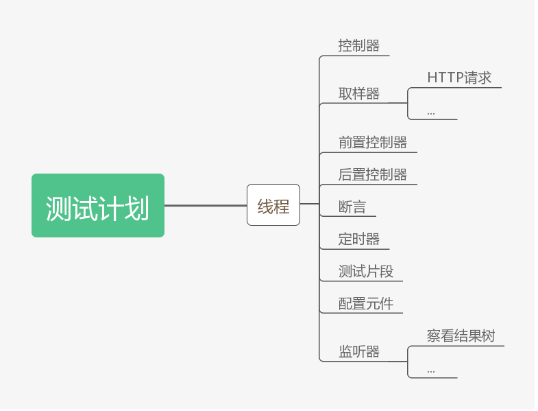

# jmeter-docs

jmeter 文档说明

> Don't use GUI mode for load testing !, only for Test creation and Test debugging.  
> 不要使用GUI模式进行负载测试，GUI 只用于创建测试 && bug 调式 -- 请使用NON GUI模式


```
|-- run.sh 运行 jmeter GUI
|-- 其它
```

## 快速入门

- [请戳这里](Hello-world.md)


## 相关概念

结构图




### threads（users）线程

- Setup thread group
    一种特殊类型的线程，可用于执行预测试操作。即执行测试前进行定期线程组的执行

- Teardown thread group
    一种特殊类型的线程，可用于执行测试后动作。即执行测试结束后执行定期的线程组

- Thread group
    通常添加使用的线程，一般一个线程组可看做一个虚拟用户组，其中每个线程为一个虚拟用户


### 测试片段（test fragment）

一种特殊的线程组，在测试树上与线程组一个层级，但是它不被执行，除非它是一个模块控制器或者被控制器所引用时才会被执行


### 控制器

用这些原件驱动处理一个测试  
- 取样器（sampler）
- 逻辑控制器（Logic Controller）


### 监听器（Listener）

对测试结果进行处理和可视化展示的一系列组件，常用的有图形结果、查看结果树、聚合报告等


### 配置原件（Config Element）


## Jmeter GUI 设置中文页面

```
find --name jmeter.properties /
```

结果: 
```
/usr/local/Cellar/jmeter/5.0/libexec/bin/jmeter.properties
```

`jmeter.properties` 第三十七行修改为 `language=zh_CN`


## 参考资料

- [《jmeter：菜鸟入门到进阶》系列](https://www.cnblogs.com/imyalost/p/7062784.html)
- [JMeter的基本介绍和入门](http://www.51testing.com/html/54/n-854654.html)